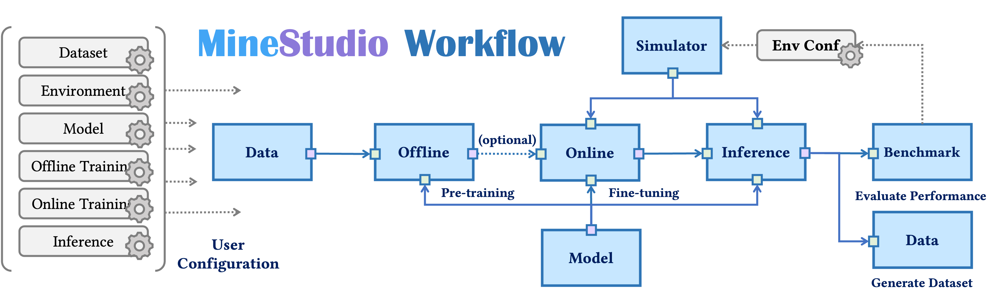

> **MineStudio** is an open-source package for Minecraft AI agent development. It lowers the engineering barrier for embodied policy research by unifying environment customization, trajectory data processing, policy modeling, offline pretraining, online finetuning, distributed inference, and benchmark evaluation.

**Authors:** Shaofei Cai*, Zhancun Mu*, Kaichen He, Bowei Zhang, **Xinyue Zheng**, Anji Liu, Yitao Liang  
*Equal contribution*

[**Paper**](https://arxiv.org/abs/2412.18293) · [**Code**](https://github.com/CraftJarvis/MineStudio) · [**Project**](https://craftjarvis.github.io/MineStudio/) · [**PyPI**](https://pypi.org/project/minestudio/)



## Abstract

Minecraft is a valuable testbed for embodied intelligence and sequential decision-making, but developing and validating new Minecraft agents often requires substantial engineering work. MineStudio provides a streamlined, open-source software package that helps researchers build, train, evaluate, and benchmark agents in a unified workflow.

The package integrates seven core components: **simulator**, **data**, **model**, **offline pretraining**, **online finetuning**, **inference**, and **benchmark**. With this modular design, researchers can focus more on algorithmic innovation and less on reimplementing infrastructure.

## Introduction

Minecraft offers a rich open-world environment: agents need to perceive high-dimensional observations, plan over long horizons, interact with objects, collect resources, craft tools, and complete diverse tasks. This makes it an ideal platform for studying embodied AI, reinforcement learning, imitation learning, and open-ended agent evaluation.

However, the Minecraft AI ecosystem has long suffered from fragmented engineering pipelines. Different works often customize environments, datasets, controllers, models, and evaluation protocols in incompatible ways. This makes it hard to reproduce results, compare agents fairly, or quickly test a new algorithmic idea.

MineStudio addresses this problem by providing a coherent development stack for Minecraft agents:

- **Simulator:** a customizable Minecraft simulator wrapper with callback-based environment configuration.
- **Data:** an efficient trajectory data structure for storing and retrieving long Minecraft demonstrations.
- **Models:** a unified policy-model template and a gallery of baseline Minecraft agents.
- **Offline training:** a practical pipeline for pretraining agents from offline gameplay data.
- **Online training:** distributed reinforcement learning support with memory-based policies and crash recovery.
- **Inference:** a parallel and distributed pipeline for running and evaluating agents at scale.
- **Benchmark:** automated batch testing for diverse Minecraft tasks, connected to open-ended evaluation with MCU.

For my broader research agenda, MineStudio is closely related to my interest in **open-ended agent evaluation**: instead of evaluating agents only on fixed small task sets, we need infrastructure that can generate, run, and diagnose many diverse tasks in complex environments.

## Quick Start

MineStudio requires Python 3.10+ and JDK 8. A minimal installation looks like this:

```bash
conda create -n minestudio python=3.10 -y
conda activate minestudio
conda install --channel=conda-forge openjdk=8 -y
pip install MineStudio
```

Test whether the simulator can launch:

```bash
python -m minestudio.simulator.entry
```

For GPU rendering with VirtualGL:

```bash
MINESTUDIO_GPU_RENDER=1 python -m minestudio.simulator.entry
```

## Minimal Usage

### Create a Minecraft simulator

```python
from minestudio.simulator import MinecraftSim

sim = MinecraftSim(
    obs_size=(224, 224),
    render_size=(640, 360),
    callbacks=[]
)

obs, info = sim.reset()
```

### Load a pretrained policy and interact with the environment

```python
from minestudio.simulator import MinecraftSim
from minestudio.simulator.callbacks import RecordCallback
from minestudio.models import VPTPolicy

policy = VPTPolicy.from_pretrained(
    "CraftJarvis/MineStudio_VPT.rl_from_early_game_2x"
).to("cuda")
policy.eval()

env = MinecraftSim(
    obs_size=(128, 128),
    callbacks=[RecordCallback(record_path="./output", fps=30, frame_type="pov")]
)

memory = None
obs, info = env.reset()

for _ in range(1200):
    action, memory = policy.get_action(obs, memory, input_shape="*")
    obs, reward, terminated, truncated, info = env.step(action)

env.close()
```

### Install from source

```bash
pip install git+https://github.com/CraftJarvis/MineStudio.git
```

## Why MineStudio Matters

MineStudio makes Minecraft agent research easier in three ways:

1. **Less engineering overhead.** Researchers can reuse a common simulator, data format, model interface, training pipeline, and evaluation framework.
2. **More reproducible comparisons.** Standardized interfaces make it easier to compare agents under shared environments and benchmark protocols.
3. **Better support for open-ended evaluation.** The benchmark module enables batch testing over diverse Minecraft tasks, which is important for discovering agent weaknesses in complex open-world settings.

## Citation

```bibtex
@article{cai2024minestudio,
  title={MineStudio: A Streamlined Package for Minecraft AI Agent Development},
  author={Cai, Shaofei and Mu, Zhancun and He, Kaichen and Zhang, Bowei and Zheng, Xinyue and Liu, Anji and Liang, Yitao},
  journal={arXiv preprint arXiv:2412.18293},
  year={2024}
}
```
